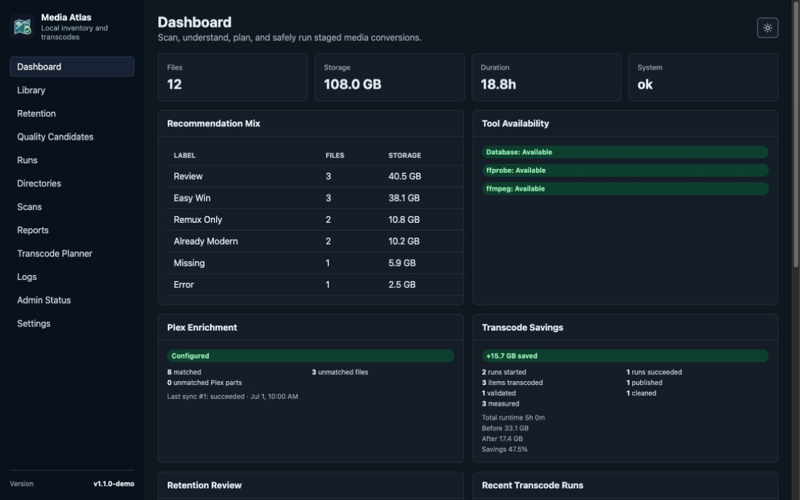
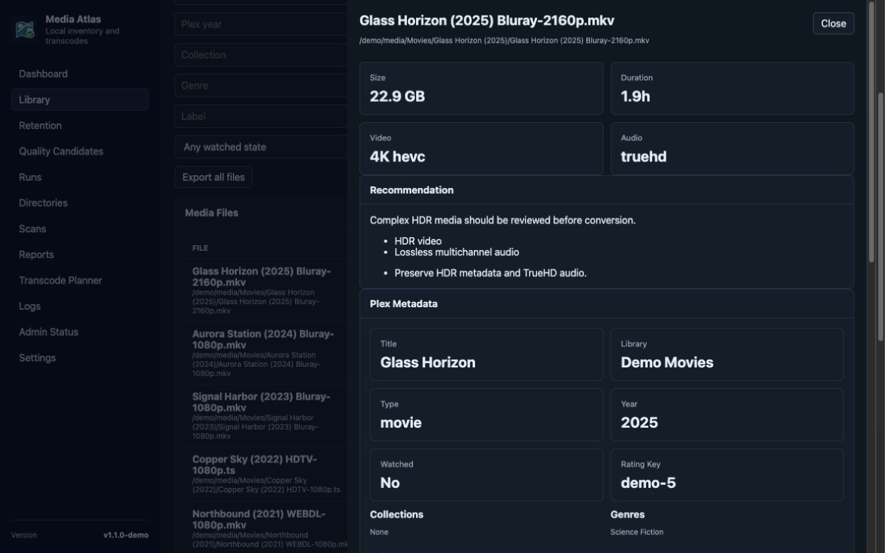
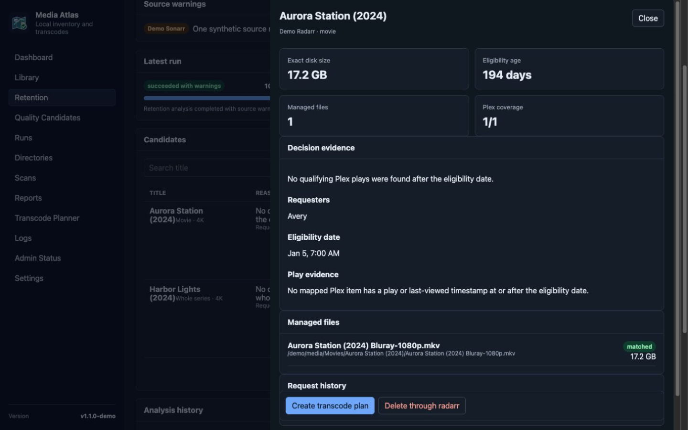
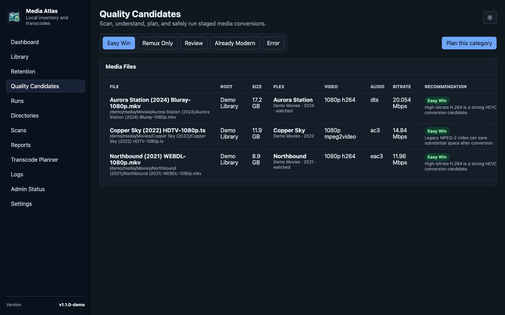
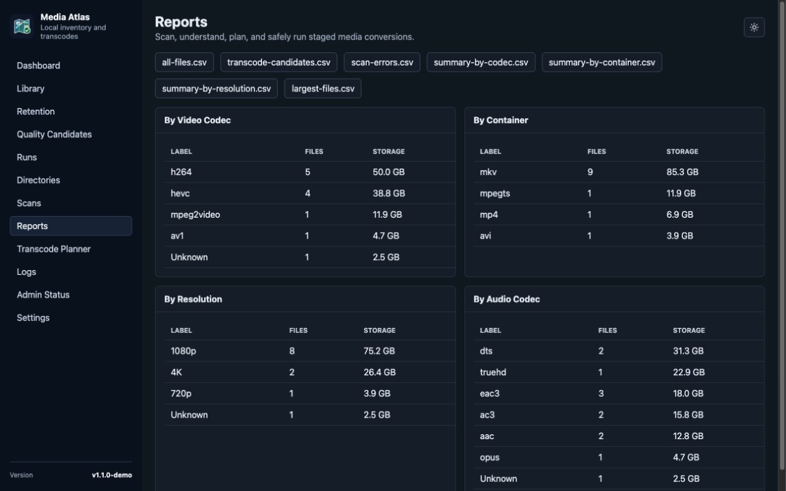
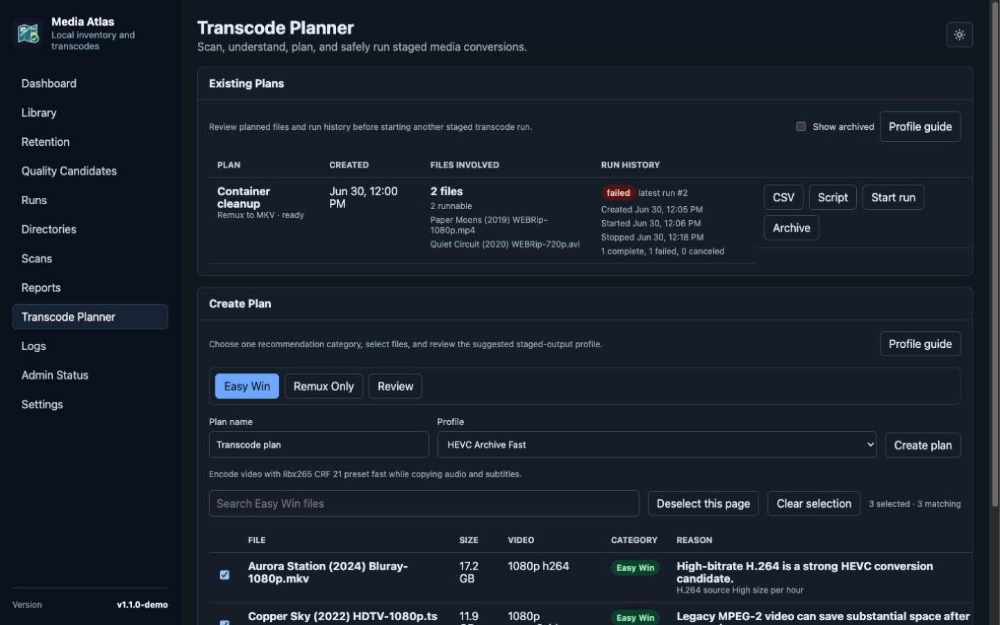
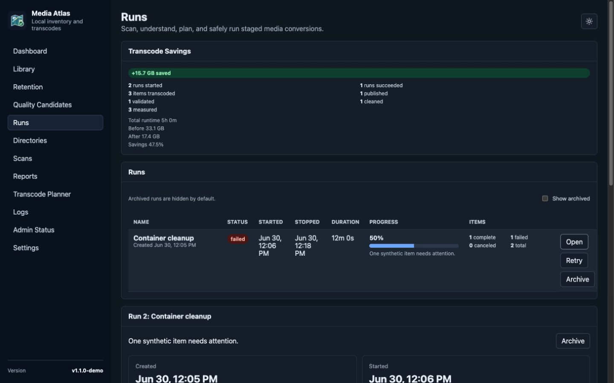
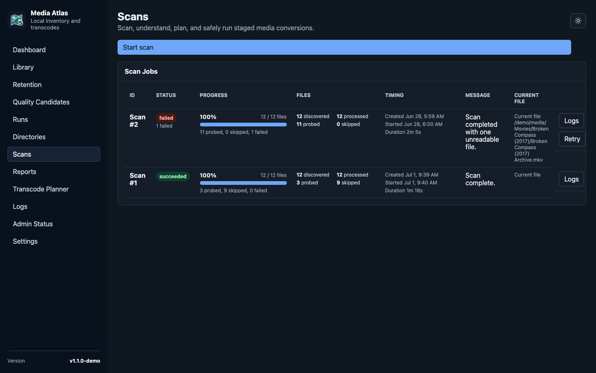
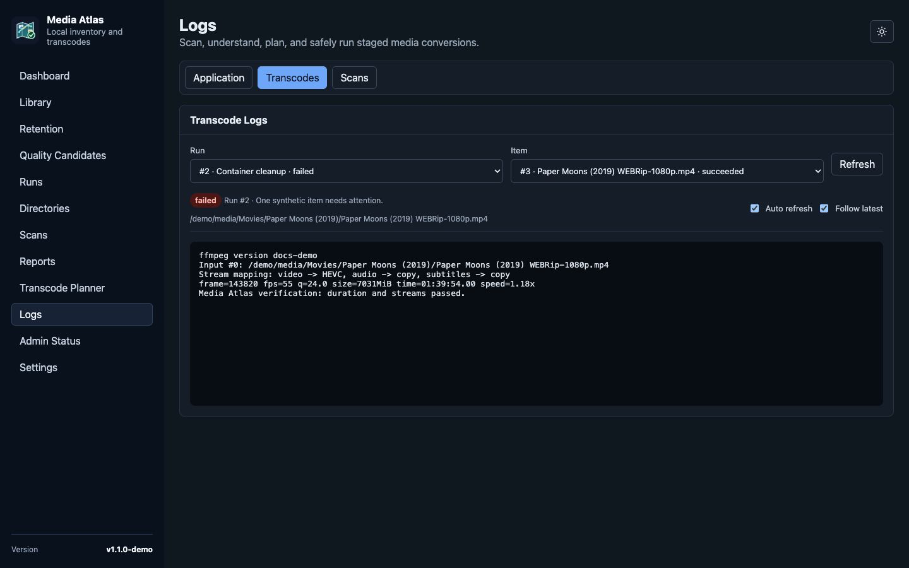
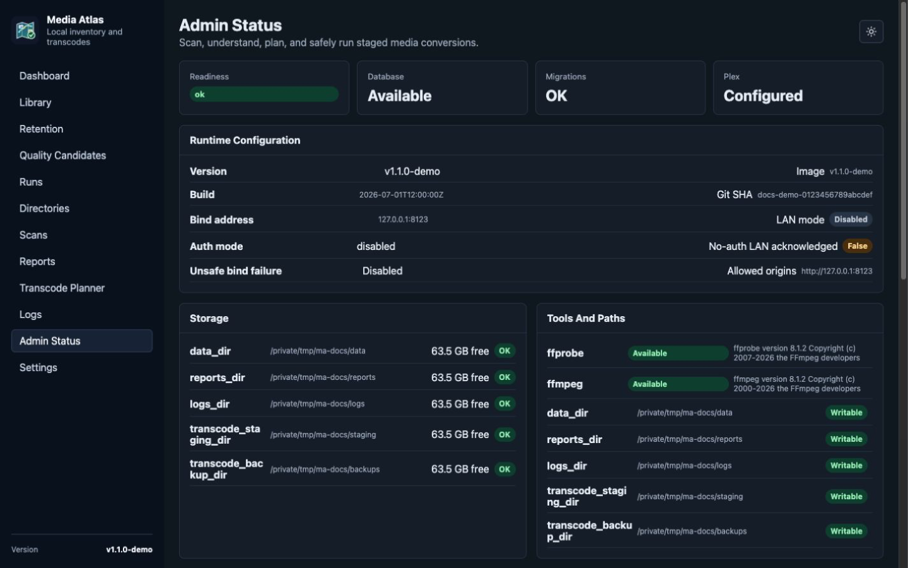

# Web UI Tour

This tour uses deterministic fictional data generated by `scripts/generate_docs_demo.py`. The titles, service endpoints, credentials, and `/demo/media/...` paths do not represent a real library or Media Atlas installation.

## Check the library at a glance

The Dashboard summarizes storage, recommendation categories, tool readiness, Plex enrichment, transcode savings, retention review, and recent jobs. The release tag stays visible in the sidebar footer.

## Inspect one media file

Search and filter the Library, then open a row to review technical media details, the recommendation rationale, and matched Plex metadata.

## Review retention evidence

Retention candidates include their eligibility age, request history, mapped files, Plex play coverage, and the evidence behind the decision. Remediation remains an explicit operator action.

## Find quality candidates

Quality Candidates groups files by recommendation. Operators can review Easy Win, Remux Only, Review, Already Modern, and Error sets before handing a category to the planner.

## Compare the inventory

Reports summarize the library by video codec, container, resolution, and audio codec, with CSV exports for deeper analysis.

## Build a staged conversion plan

The Transcode Planner shows existing plans and run history alongside a searchable plan builder. Profiles explain the intended conversion, and files must be selected before a plan can be created.

## Monitor transcode runs

Runs track cumulative savings, job progress, item outcomes, and timing. Opening a run reveals its per-item verification, publish, validation, and cleanup state.

## Diagnose scans

Scans preserve successful and failed job history, progress, file counts, timing, current paths, and links to detailed errors.

## Follow job output

Logs separates application, transcode, and scan diagnostics. The transcode view follows persisted FFmpeg output for a selected run item without requiring terminal access.

## Verify deployment health

Admin Status collects readiness, version and build metadata, runtime settings, storage checks, tool availability, job state, recent failures, and maintenance downloads.

See [Development](DEVELOPMENT.md#refresh-the-web-ui-tour) for the reproducible fixture and screenshot refresh workflow.
